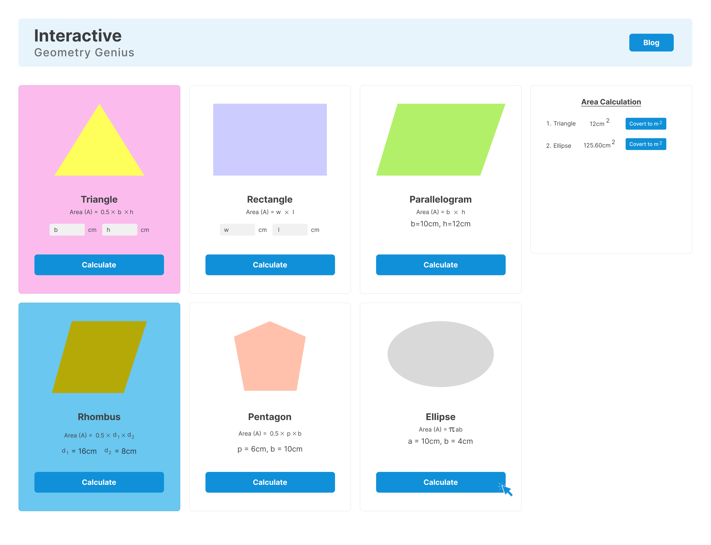

# pghero-assignment5
This project is a clone of the following design.

## Learning Outcome
1. DOM
2. Basic Js
3. Bootstrap

## Resource Link
[Click here](https://github.com/ProgrammingHero1/geometry-genius-resources)

## Live Website Link
[Click here](https://zippy-unicorn-0b7f5d.netlify.app)

## Helpful Resources
- [Format number to always show 2 decimal places](https://stackoverflow.com/questions/6134039/format-number-to-always-show-2-decimal-places)
- [Pad a string in JavaScript](https://medium.com/coding-at-dawn/how-to-pad-a-string-in-javascript-3ea75c67541c)
- [Add ID to Element Using JavaScript](https://linuxhint.com/add-id-to-element-using-javascript/#:~:text=To%20add%20the%20id%20to,%2C%20such%20as%20%E2%80%9Cabc%E2%80%9D.)

- [Check if NaN is equal to NaN](https://www.samanthaming.com/tidbits/21-how-to-test-nan/)

- [Generate a Random Color in JavaScript](https://css-tricks.com/snippets/javascript/random-hex-color/)